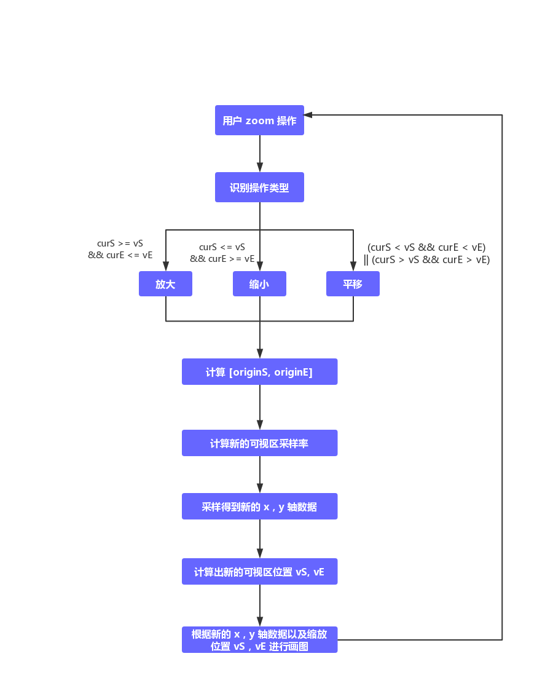
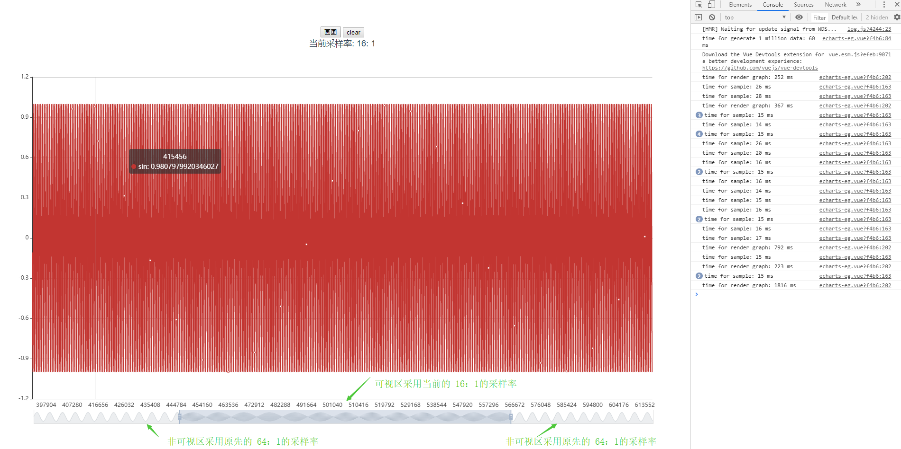
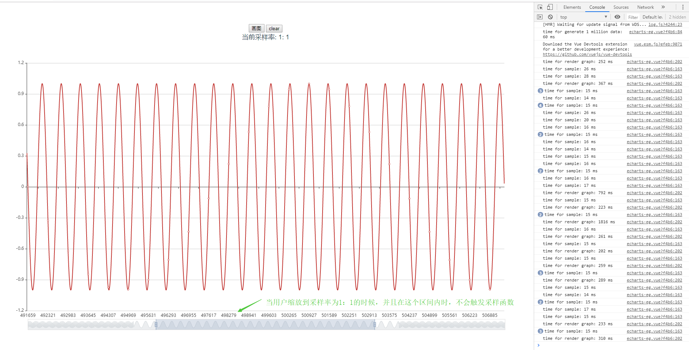

# echarts 百万数据 折线图优化

随着 echarts 4.0 的发布，官网宣布可以支持千万数据量的渲染了，但目前并非支持所有的图，只支持散点图，线图 [点此查看](https://www.echartsjs.com/zh/api.html#echartsInstance.appendData)

而针对最基本的折线图等官方虽然提供了采样功能，但在上百万个点的情况下，页面仍就十分卡顿，并且官方提供的采样率是根据屏幕分辨率来计算的，采样过后显示的点数过少，原曲线信息丢失较多。

针对以上问题，又加上最近业务需要渲染显示几百万个点的折线图，这里对 echarts 画折线图做一个优化，最终经测试，在几百万个点的场景下依然能流畅的进行缩放等用户交互操作，并且本方法也同样适用于 echarts 总的其他图，没有任何限制。

## 方法介绍

在介绍本方法之前，首先介绍下几个概念：

1. 可视区：即用户看到的区域。因为 echarts 是支持用户进行缩放的，所以在图表中的可视区会不断的改变。这里举个例子说明：假设现在页面上渲染了 10000 个点，横坐标就是 [0, 9999]，那么此时的可视区就是 [0, 9999]，当用户进行缩放的时候，此时横坐标可能就变成了 [1000, 8000]，所以可视区也就变成了 [1000, 8000]，此时用户能看到的也就是这个区间的内容，剩下的 [0, 999], [8001, 9999] 区间的数据用户是看不到的。
2. 非可视区：即在图标上用户看不到的区域。

其实 echarts 中的开启采样功能也是类似的。当开启采样功能以后，用户在可视区中始终只能看到固定的点数，这个点数和屏幕分辨率是相同的，也就是一个像素点对应一个 x 轴数据。

但 echarts 中的采样功能是在内部实现的，本质上还是要计算所有的点的位置等信息，所以当数据量达到上百万的时候，计算渲染就特别的卡顿（虽然屏幕上只显示采样后的点，但所有的原始数据都要加入到计算中）。

针对上述 echarts 中采样的局限性，本方法将采样过程放到了 js 函数中做，利用 js 的高性能，实时的计算采样后的数据，然后将采样后的数据传递给 echarts 进行渲染。这样就能始终将需要渲染的点的个数控制在一个合理的范围内，而不受总数据量大小的影响。

当然，对于采样率的选择，这里分为了可视区以及非可视区两部分。针对可视区，因为是用户当前看到的区域，因此肯定是点数越多（这里点数可以进行设置），曲线信息越详细。

而针对非可视区，因此此时用户看不到，所以可以采用较大的采样率，来减少点的个数。

以下是这个算法的流程图：

## 测试

下面给出了100万个点的折线图渲染测试：

我们可以看到在可视区中的采样率较小，因此信息量较多，而非可视区中的采样率较大，用来保证总的点数在一个范围内。
并且在整个缩放的用户交互中都比较流畅，不会出现之前的那种明显卡顿的情况。

